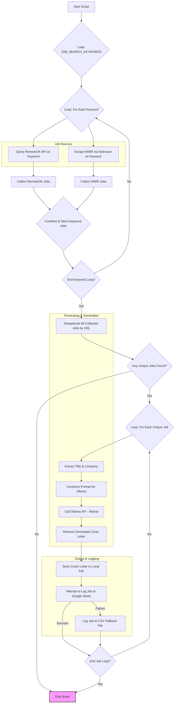

## Workflow Diagram


```mermaid
graph TD
    A[Start Script] --> B{Load JOB_SEARCH_KEYWORDS}
    B --> C{Loop: For Each Keyword}
    C --> D[Query RemoteOK API w/ Keyword]
    C --> E[Scrape WWR via Selenium w/ Keyword]
    D --> F[Collect RemoteOK Jobs]
    E --> G[Collect WWR Jobs]
    F --> H{Combine & Store Keyword Jobs}
    G --> H
    H --> I{End Keyword Loop?}
    I -- No --> C
    I -- Yes --> J[Deduplicate All Collected Jobs by URL]
    J --> K{Any Unique Jobs Found?}
    K -- No --> Z[End Script]
    K -- Yes --> L{Loop: For Each Unique Job}
    L --> M[Extract Title & Company]
    M --> N[Construct Prompt for Ollama]
    N --> O[Call Ollama API - Mistral]
    O --> P[Receive Generated Cover Letter]
    P --> Q[Save Cover Letter to Local File]
    Q --> R[Attempt to Log Job to Google Sheet]
    R -- Success --> T{End Job Loop?}
    R -- Failure --> S[Log Job to CSV Fallback File]
    S --> T
    T -- No --> L
    T -- Yes --> Z

    subgraph Job Sources
        D
        E
    end

    subgraph Processing & Generation
        J
        M
        N
        O
        P
    end

    subgraph Output & Logging
        Q
        R
        S
    end

    style Z fill:#f9f,stroke:#333,stroke-width:2px
```

## Usage

```bash
   cp .env .env.example
```
